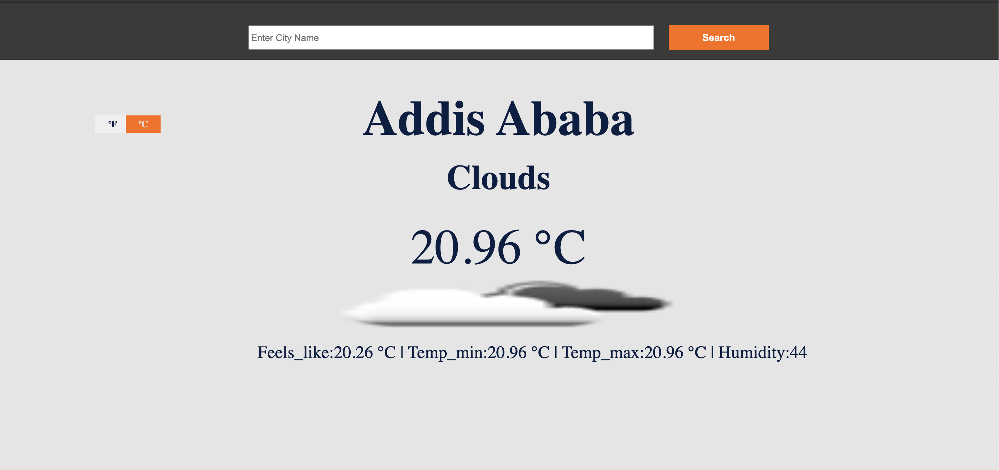

# Weather App

> Weather app is a desktop-only app where user can search and get the current weather condition of any city. Is built by fetching data from weather map.

## Built With

- Javascript
- HTML
- CSS3
- Webpack

## Live Demo

[Live Demo Link](https://addis0943.github.io/Weather-App/)

## Getting Started

To set up a local copy of the project

- `git clone git@github.com:Addis0943/Weather-App.git`
- `cd Weather-App`

If you want to repack the file

- Run `npm install` on the terminal to install dependancies
- Run `npx webpack` to bundle the files in the src folder & product ouput in dist folder

  or

- Go to the dist folder and open index.html

## Live Link of the project

[Live-Link](https://todo5600.netlify.app/)

## Author

👤 **Addis Belete**

- GitHub: [@Addis0943](https://github.com/Addis0943)
- Twitter: [@Addis32018084](https://twitter.com/Addis32018084)
- LinkedIn: [LinkedIn](https://www.linkedin.com/in/addis-belete-134b98191/)

## 🤝 Contributing

Contributions, issues, and feature requests are welcome!

Feel free to check the [issues page](../../issues/).

## Show your support

Give a ⭐️ if you like this project!

## Acknowledgments

- Hat tip to anyone whose code was used
- Inspiration
- etc

## 📝 License

This project is [MIT](./MIT.md) licensed.
